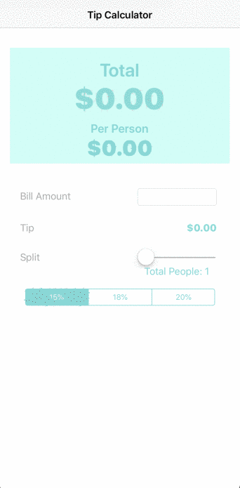

@Author Nooman Muhammad

**tipcalc** is a tip calculator application for iOS.

## Functionality

- User can enter a bill amount, choose a tip percentage, and see the tip and total values.
- User can select between tip percentages by tapping different values on the segmented control and the tip value is updated accordingly

- Made it so that the bill amount can be split based on the amount of people on the split slider (range: 1 - 10 People)
- Slight Improved UI of App from the template

## Video Walkthrough

Here's a walkthrough of implemented functionality:

## Notes

First project in Swift to help better understand language syntax and basic features

